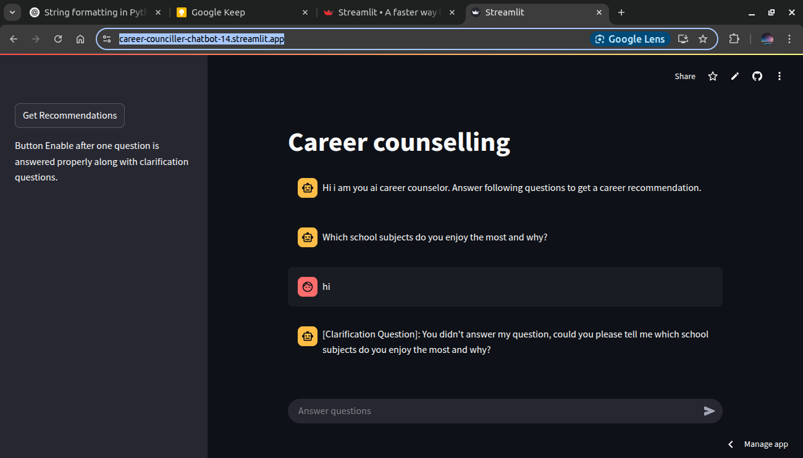

# Career Recommendation chatbot

Recommend career in following fields:
    1. STEM (Science, Technology, Engineering, Mathematics)
    2. Arts
    3. Sports

The chat bot asks following 3 questions, if answer of student is not clear it ask for **Clarification**:

1. Which school subjects do you enjoy the most and why?
2. Do you prefer solving problems logically, expressing ideas creatively, or engaging in physical activities?
3. Who inspires you more — a scientist/engineer, an artist/writer, or an athlete?

## Prompts 
Prompts given chatbot are given in file in the current repo:
```
prompts.yaml
```
## Technology used:
1. LLM: Llama 3.3 70B (groq api)
2. Langchain and langgraph
3. Streamlit: To build frontend

## Preview
Visit [Link](https://career-counciller-chatbot-14.streamlit.app/) to have live preview

